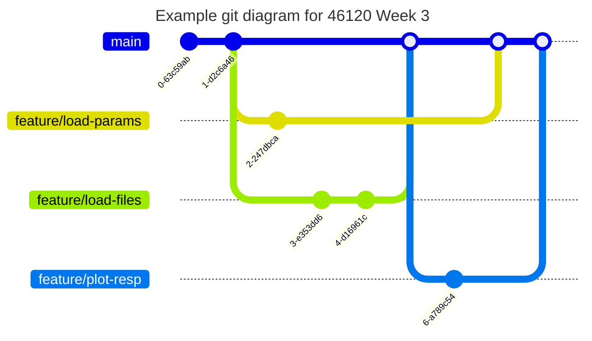

# PiWE Week 3: CodeCamp and Turbie

Slides from lecture:  
 * In this subfolder.


## Overall objectives

Welcome to Turbie! This is the beginning of the CodeCamp group project.

1. Watch videos/read description about Turbie (the simple wind-turbine model).  
1. Write functions and a script that executes the functions that...
   * Load time series from text files.  
   * Plot time series data using `matplotlib`.  
   * Load parameters from file and then create and manipulate numeric arrays using `numpy`.  


## Create team by deadline or get random teammates

* Each student is responsible for finding a team.
* If you intend to drop 46120, delete your name from sign-up sheet on Learn.  
* Enrolled students: by Monday, February 23 at 23:59 you must...  
   - Form a team via sign-up sheet on Learn  
   - Join your team's CodeCamp repo via link on Learn  
* Any unassigned students remaining in sign-up sheet after deadline will be randomly assigned to teams.  

## Homework due next week

The instructions this week have less detail on the git workflow than last week.
We do recommend feature branches based on tasks, and we still expect PRs with separate reviewers/authors.
But you as a team shall decide the specifics of when to merge, pull, rebase, etc..

NB:
 * The features in branch `feature/load-files` (Part 3A) are more time-intensive than the other features.  
 * The features in branch `feature/plot-resp` (Part 3B) cannot be started until Part 3A is merged.  




### Part 1: As a team, in class

Form CodeCamp groups and align expectations.

1. Form groups of 2 to 3 people and decide on a team name.  
1. Sign up all members of your team:  
   * Learn / Content / Administration / Programming teams, tab "codecamp-teams".  
   * Copy names from left column to a team box on the right. Add your team name.  
   * **!!! Be sure all names are properly deleted from left column !!!**  
1. ONE person from your group:  
   * Under Learn / Content / Administration, click the link for the GitHub Assignment
     for CodeCamp.  
   * When prompted, create a new team. Name your team what you wrote in the sign-up
     sheet.  
   * Once team repo is created, star it so you can find it later.  
1. Other group members should now click the same link on Learn for the GitHub
   assignment BUT join the existing team.  
   * Once you've joined the team repo, star it so you can find it later.  
1. Clone the new CodeCamp team repo locally to your computer.  
1. Team meeting. Have someone take notes during the meeting and summarize your ultimate agreements in a file called `Collaboration.md` in your CodeCamp team repo.  
    * Who will author/review which feature branches this week?  
    * How are you collaborating during development, if at all? E.g., pair programming?  
    * How will you review the PRs? E.g., will you meet as a team to review PRs, or...?  
    * What is the internal deadlines for accomplishing which tasks?  
    * What will you do if a team member does not meet their deadline?  
    * How are you communicating?  
    * Note-taker pushes `Collaboration.md`, and other members pull.  
1. Open your team repo locally and start looking through the files. Discuss together:  
    * What files are there, and what is the folder structure?  
    * Open the week 3 test file `test_week3.py`. What do you think the tests will check for?  
         * **DO NOT TRY TO MAKE THE TESTS PASS NOW! Just look at them.**

### Part 2: Individually

Acquire background information for Turbie.

1. Watch "Introduction to Turbie", 9 minutes [10:01 - 19:45] [Introduction to Turbie](https://panopto.dtu.dk/Panopto/Pages/Viewer.aspx?id=33445122-c93b-491e-9db3-afa000fc777c&start=601) from CodeCamp 2022
1. Skim Appendix of this week's slides (in this folder).
1. Read the Definition page of Turbie in this folder  
1. Watch "Day 1 (Part B)", 8.5 minutes [0:00 - 8:36] [Day 1 (Part B)](https://panopto.dtu.dk/Panopto/Pages/Viewer.aspx?id=cc28450d-9335-40a6-8ed6-b10d00d31085) from CodeCamp 2022.

### Part 3: Individually and/or with your team

Distribute tasks in this part per your in-class discussion (Part 1).
Development is complete when feature branches are merged such that all week3 tests on `main` pass and `code_week3.py` demonstrates functions as specified below.

Add your code to existing files in repo as specified in instructions.
You should not need to create any new files.

#### A: Functions to load data from a text file

1. Check out into feature branch `feature/load-files`.
1. Run the tests for this week, which should all fail.  
    * Open an Anaconda Prompt.  
    * Change directory to your local copy of your team's repo.  
    * Run pytest on this week's test: `pytest test_week3.py`.  
    * There should be some white and red text and notes about failures. 
1. In a text editor of your choice, open the results file `resp_12_ms_TI_0.1.txt`.
   You can find the file in the `data` folder on your CodeCamp Team
   repo. How many columns are there? What does each column represent?
1. Scroll through the results file and find out what the wind speed
   is at $t=60$ s. What are the responses at $t = 345$ s?
1. In `codecamp/__init__.py` on your team repo, make a function called `load_resp()`:  
    * Loads the Turbie response saved in a text file. Assume same format as `resp_12_ms_TI_0.1.txt`. **HINT!** Look up `np.loadtxt()`.   
    * Function input(s): `path_resp`, which is the path to the file (string or a `pathlib.Path`).
    * Function output(s): 4 1-dimensional NumPy arrays, `t`, `u`, `xb`, and `xt`.  
    * Keyword argument(s): `t_start` (int/float; default = 60).
      Allows a user to specify a start time (inclusive) for the data returned by the function. 
      For example, if the data in the file starts at 0 seconds and ends at 660 but a user specifies `t_start=45`, then the function would only return the data from
      45 seconds onwards.
         * If you aren't familiar with keyword/default arguments, [this is a nice tutorial](https://www.educative.io/answers/what-are-keyword-arguments-in-python).
1. Add code to `code_week3.py` such that, when you run the script, it calls `load_resp()` on `resp_12_ms_TI_0.1.txt`.  
   * Be careful defining relative paths to files. See helper code in `code_week3.py`.  
   * NB: we already imported the `codecamp` local package for you.
     Since you added `load_resp()` to `codecamp/__init__.py`, you can simply call `codecamp.load_resp()`. See existing example in `code_week3.py`.    
      * We'll learn more about why this when we talk packaging.
      But if you are curious, [here is a tutorial about importing](https://diveintopython.org/learn/functions/import-functions).  
1. Re-run the weekly tests. A few should now be passing. If they are all still
   failing, check your `load_resp()` function and the related tests.  
1. Make a similar function called `load_wind()` and place it in
   `codecamp/__init__.py`. The `load_wind()` function should:  
    * Loads the Turbie wind time series saved in a text file.
      Assume same format as `wind_12_ms_TI_0.1.txt`, in `data/` folder.  
    * Function input(s): `path_wind`, path to the wind data file (string or a `pathlib.Path`).  
    * Function output(s): 2 1-dimensional NumPy arrays, `t_wind`, `u_wind`.  
    * Keyword argument(s): `t_start` (int/float; default = 0).
      Same concept as in `load_resp()`.
1. Modify `code_week3.py` so the code calls `load_wind()` on `wind_12_ms_TI_0.1.txt`.  
1. Re-run your tests. Everything related to `load_wind()` and `load_resp()`
   should now be passing.  
1. Use drawio to make black-box diagram of your functions and put the diagram in the top level of your repo.  
1. Open a PR, review, merge.  

#### B: Functions to plot data using matplotlib

You must have `load_resp()` from Part 2A merged to main before you can start this task.
You'll first write the plotting code in `code_week3.py`, after which you'll move the reusable code to a function in `codecamp/__init__.py`.  

1. Check out into feature branch `feature/plot-resp`.
1. Append code to `code_week3.py` that makes a plot of the time series loaded in Part 2A.
   The figure should:  
    * Have two subplots, the top showing the wind speed and the
      bottom showing the blade and tower deflections (two lines on
      the same plot).  
    * Have x-limits going from 60 to 660.  
    * Have the axes/subplots labelled as you see fit.  
    * **TIPS**:
      * See [this matplotlib tutorial](https://matplotlib.org/stable/gallery/subplots_axes_and_figures/subplots_demo.html) for how to make a figure with multiple subplots.  
      * Use the keyword argument `figsize` to control the aspect ratio of the plot. E.g.:  
```fig, axs = plt.subplots(2, 1, figsize=(9, 4))```  
      * Be sure to add `fig.tight_layout()` and `plt.show()` at the very end of your plotting code.  
    This improves the format and shows the plot, respectively.
1. Move the plotting code to a function called `plot_resp()` that:  
    * Is placed in `codecamp/__init__.py`.  
    * Function input(s): the 4 numpy arrays returned from `load_resp()`.  
    * Function output(s): `fig` (matplotlib Figure) and `axs` (2-element numpy array).
    * Keyword argument(s): `xlim` (tuple; default = `(60, 660)`).
      Start and stop times to plot.  
    * Include the final calls to `fig.tight_layout()` and `plt.show()` in your function.  
1. Rerun the tests. Does the test related to `plot_resp()` pass?  
1. Rewrite `code_week3.py` so it calls `plot_resp()` to create the plot.  
1. Add black-box diagram of your function(s) to repo.  
1. Open a PR, review, merge.  

#### C: Functions to load parameters and construct Turbie matrices

1. Check out into feature branch `feature/load-params`.
1. Run tests and see which are failing.  
1. Open the `data/turbie_parameters.txt` file in VS code and
   inspect it. What are the different variable values stored in the
   file?
1. Write a function `load_turbie_parameters()` that:  
    * Loads the Turbine parameters from a text file to a dictionary.
      Assume same format as `data/turbie_parameters.txt`.  
    * For a simple option, it's okay to hard-code the dictionary keys in your function, then loading the values with `np.loadtxt()`, utilizing the function's keyword argument `comments`.  
         * To make more robust code, see [Extra Credit](#extra-credit).
    * Function input(s): path to the parameters text file (string or `pathlib.Path` object).
    * Function output(s): dictionary with every value in the text file listed as a key
      in the dictionary.  
1. Place `load_turbie_parameters()` in `codecamp/__init__.py`. Update
   `code_week3.py` such that it calls `load_turbie_parameters()` to load the parameters.  
1. Re-run tests. Is the test for this new function passing?  
1. Create a function `get_turbie_system_matrices()` that:  
    * Takes as input the path to the parameters text file (type is
    string or `pathlib.Path` object).  
    * Loads the variables in the text file using your
    `load_turbie_parameters()` function and then assembles Turbie's
      mass, stiffness, and damping matrices.  
    * Returns `M`, `C`, and `K`.  
1. Re-run tests. Is the test for this new function passing?  
1. Update `code_week3.py` such that it imports/calls
   `get_turbie_system_matrices()` and defines variables `M`, `C`, and
   `K` in the script.  
1. Add black-box diagram of your function(s) to repo.  
1. Open a PR, review, merge.  


## Extra credit

As noted in earlier weeks, parts marked "extra credit" have no bearing on your grade.
This is extra material if you want more practice or exposure to more advanced topics.

Suggested:

* Set up the testing panel in VS Code so you your test suite is integrated in VS Code.  
* Modify `load_turbie_parameters()` such that it also loads variable names from the text file.  
* Start discussing with your team how you might structure code for last part of CodeCamp projet.
  **NO CODE!** Diagrams/pseudocode/etc. only.
* Practice setting breakpoints and using VS Code Python debugger.
  Halt the code in `code_week3.py` or in the middle of a function in `codecamp/__init__.py`, inspect and play with variables in the Debug Console, etc.
  See what variables are defined in which namespaces in the VARIABLES panel.  
* Enable a linter in VS Code (e.g., `pylint`) and see what it flags in the code you wrote this week.  


Further:

* Watch the "Eigenanalysis" chapter in [CodeCamp Day 2](https://panopto.dtu.dk/Panopto/Pages/Viewer.aspx?id=82d3d6fd-f3ad-420f-abfd-afa000fd43d9) and complete exercise "Calculate Turbie's natural frequency".
* Watch any other chapters in the [CodeCamp Day 1 videos](https://panopto.dtu.dk/Panopto/Pages/Sessions/List.aspx?folderID=ce2dc79a-9a96-41a1-a048-af9b00bd02dc)
   that seem interesting.
* Complete exercise on [Power spectral density](https://python-at-risoe.pages.windenergy.dtu.dk/codecamp/turbie/3-psd.html). 
  Compare what you see in your PSD plot with the natural frequencies from the eigenanalysis. Does anything match?

